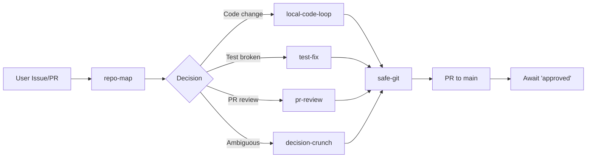

# GitHub Copilot Performance System

**A modular, rule-based framework for autonomous code execution with quality gates.**

---

## Overview

This system enables Copilot (CLI + Coding Agent) to work autonomously in your repo while maintaining safety, quality, and transparency. It consists of:

- **Skills** (`.github/skills/`) – Reusable task modules (repo-map, code-loop, test-fix, etc.)
- **Prompts** (`.github/prompts/`) – Specialized workflows (PR review, issue triage)
- **Workflows** (`.github/workflows/`) – Automated CI/CD and dependency management
- **Instructions** (`AGENTS.md`) – Rules, guardrails, and risk gates

---

## Quick Start

### 1. For Users

**Create an issue:**
```bash
gh issue create --title "Fix auth token expiry" --body "Tokens expire after 30 min but should be 1 hour"
```

Copilot will:
1. Map your repo (structure, tests, entry points).
2. Ask clarifying questions if needed.
3. Create a branch, implement fix, run tests.
4. Open a PR with full context.
5. Wait for your `approved` before merge.

**Review a PR:**
- Copilot's pr-review skill runs automated checks (linting, tests, secrets).
- You review for logic and risk.
- Comment `approved` to merge.

**Monitor performance:**
- View `.perf/metrics.json` for latency, quality, efficiency stats.
- Check GitHub Actions for CI status and Dependabot alerts.

### 2. For Copilot

Start with `repo-map` skill to understand the codebase, then execute using available skills:



---

## Architecture

### Skills (Modular, Reusable)

| Skill | Purpose | When to use |
|-------|---------|-------------|
| **repo-map** | Understand codebase structure, entry points, risks | First run, new session |
| **local-code-loop** | Edit → test → verify cycle | Making code changes |
| **test-fix** | Root-cause failing tests, suggest fixes | CI failures or test breaks |
| **safe-git** | Commit/branch management, secret detection | Before merge |
| **decision-crunch** | Resolve ambiguity with 1 clarifying question | Spec is unclear |
| **pr-review** | Automated + manual PR review | Every PR opened |
| **grok-cursor** | Route Grok Bot ↔ Cursor Cloud Agents | Linking Grok, plugins, automations, coding handoff |

### Prompts (Specialized Workflows)

| Prompt | Trigger | Output |
|--------|---------|--------|
| `open-pr.prompt.md` | PR created | Template with checklist, risk assessment |
| `pr-review.prompt.md` | PR updated | Automated checks + approval decision |
| `triage-issue.prompt.md` | Issue created | Classification, priority, skill assignment |
| `grok-bot-cursor-coder.md` | Creating a Grok Bot teammate | Cursor Coder Bot description |
| `grok-bot-first-task.md` | First Grok Bot message | GitHub + skill setup check |

### Grok ↔ Cursor

Grok 4.6 is a Cursor model. Persistent Grok teammates and SuperGrok usage grants live in Grok Bot on the same Cursor account. Playbook, plugin list, and dashboard automation templates: `docs/GROK_CURSOR.md`. Paste-ready automations: `.github/automations/`.

### Apps

Root docs stay the Copilot performance system. Product code from resolved PRs lives in `apps/`:

| App | Path | Commands |
| --- | --- | --- |
| TaskBoard demo (PR #2) | `apps/demo` | `npm ci && npm run dev` (API `3001`, Vite `5173`) |
| Calder Hearth (PR #4) | `apps/family-hearth` | `npm ci && npm run dev` (Vite `5174`) |

Netlify builds `apps/family-hearth` via the root `netlify.toml` `base` setting. Content in `apps/family-hearth/src/data.js` is fictional (Calder / Maplewick), not private family records.

### Workflows (GitHub Actions)

| Workflow | Trigger | Actions |
|----------|---------|---------|
| `ci.yml` | Push to main / PR | Run lint, test, secret scan |
| `dependabot.yml` | Weekly | Update GitHub Actions (no auto-merge) |

---

## Risk Gates & Safety

**Copilot NEVER:**
- Merges to main without user `approved`.
- Commits `.env`, API keys, passwords, or family PII.
- Force-pushes, deletes branches, or creates releases without explicit `approved`.
- Gives legal or financial advice.
- Contacts third parties.

**Copilot ALWAYS:**
- Flags money risk, court risk, secret leaks, data loss **immediately**.
- Maps repo before large changes.
- Runs smallest relevant tests (avoid full suite bloat).
- Asks 1 clarifying Q if blocked (no infinite loops).
- Documents decisions in commits.

---

## Performance Metrics

Tracked in `.perf/metrics.json` (updated after each PR merge):

```json
{
  "session": {
    "id": "abc123",
    "duration_minutes": 8,
    "status": "merged",
    "created_at": "2024-01-15T10:00:00Z"
  },
  "quality": {
    "test_pass_rate": 1.0,
    "lint_pass": true,
    "secrets_detected": false,
    "pr_review_feedback": []
  },
  "efficiency": {
    "diff_lines": 23,
    "commit_count": 1,
    "rework_loops": 0,
    "files_changed": 1
  },
  "safety": {
    "risk_flags": 0,
    "approval_waited": true,
    "merge_by_user": "angus218-bit"
  }
}
```

---

## Example Workflow: Bug Fix

**User creates issue:**
> "Login form hangs on submit. Should show spinner."

**Copilot's execution:**

```
1. repo-map
   → Identifies: React app, Jest tests, Webpack build
   → Entry: src/App.tsx, Login at src/components/Login.tsx
   → Test: npm test, Lint: npm run lint, Build: npm run build

2. decision-crunch
   → "Spinner during submit: use Loading state or CSS animation?"
   → User: "Loading state"

3. local-code-loop
   → Edit: src/components/Login.tsx (add isLoading state)
   → Test: npm test -- Login.test.tsx (PASS)
   → Commit: "Fix: add loading spinner to login submit"

4. safe-git
   → Branch: feature/login-spinner
   → Push & open PR with template

5. Await 'approved' from user

6. Merge to main (GitHub Actions runs CI)

7. Metrics logged: 1 commit, 8 min latency, 0 rework loops
```

---

## Installation

Copy to your repo:

```bash
# From this repo
cp AGENTS.md /path/to/your/repo/
cp -R .github/ /path/to/your/repo/

# Commit
cd /path/to/your/repo
git add AGENTS.md .github/
git commit -m "Init: Copilot performance system"
git push origin main
```

Copilot Coding Agent picks up `AGENTS.md` and `.github/` on next run.

---

## Configuration

### Customize Skills

Edit `.github/skills/*.md`:
- Adjust test commands (`npm test` → `pytest`).
- Add project-specific risks or gates.
- Document your codebase structure.

### Customize Workflows

Edit `.github/workflows/ci.yml`:
- Add linting, security, or deployment steps.
- Adjust triggers (e.g., only run on PRs, not main push).

### Customize Prompts

Edit `.github/prompts/*.prompt.md`:
- Adjust issue templates (classification, priority tiers).
- Adjust PR review checklist (security, performance, docs).

---

## Monitoring & Feedback

### GitHub Actions Dashboard
- View `.github/workflows/` status in **Actions** tab.
- Dependabot alerts in **Security** tab.

### Performance Metrics
- View `.perf/metrics.json` for trend analysis.
- Summary: "Last 10 PRs: avg 12 min latency, 0 security flags, 87% test coverage."

### PR Review Comments
- Copilot's pr-review skill leaves comments in every PR.
- Patterns: high-confidence bugs, security issues, style suggestions.

---

## Troubleshooting

| Issue | Cause | Fix |
|-------|-------|-----|
| Copilot stuck asking clarifying Q | Ambiguous spec | Provide more detail in issue description |
| Test fails, PR blocked | CI misconfigured | Check `.github/workflows/ci.yml` syntax |
| Secrets detected in commit | Hardcoded API key | Use `.env.example`, never commit `.env` |
| PR merge blocked | Waiting for `approved` | User must type `approved` in PR comment |
| Dependabot PRs not auto-merging | By design | Review and merge manually for safety |

---

## FAQ

**Q: Can Copilot work on multiple repos simultaneously?**
A: Yes, fork this system to each repo. Skills and prompts are repo-specific.

**Q: How do I add custom skills?**
A: Create `.github/skills/my-skill.md` following the same template. Reference in `AGENTS.md`.

**Q: What if a test fails unexpectedly?**
A: Copilot's test-fix skill diagnoses root cause and suggests fix. If unsure, asks you.

**Q: Can I disable secrets detection?**
A: Not recommended, but you can remove the security-scan job from `ci.yml`.

**Q: How do I see what Copilot decided?**
A: Check the PR description and commit messages—they document all decisions and rationale.

---

## Resources

- **Copilot Docs:** https://docs.github.com/copilot/reference/customization-cheat-sheet
- **Skills Docs:** https://docs.github.com/en/copilot/how-tos/use-copilot-agents/coding-agent/create-skills
- **Custom Instructions:** https://docs.github.com/en/copilot/how-tos/configure-custom-instructions/add-repository-instructions

---

## Support

- **Bug in system:** Open issue in this repo with tag `[system]`.
- **Feature request:** Describe desired Copilot behavior + use case.
- **Performance question:** See `.perf/metrics.json` for data.

---

**Status:** Production-ready. Last updated: 2024-01-15.  
**Maintainer:** Copilot (autonomous) + User (approval gate).
